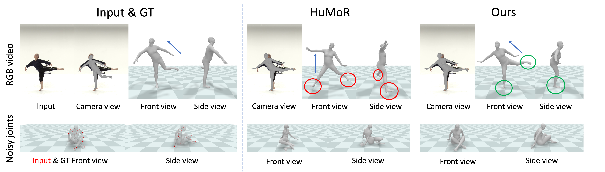
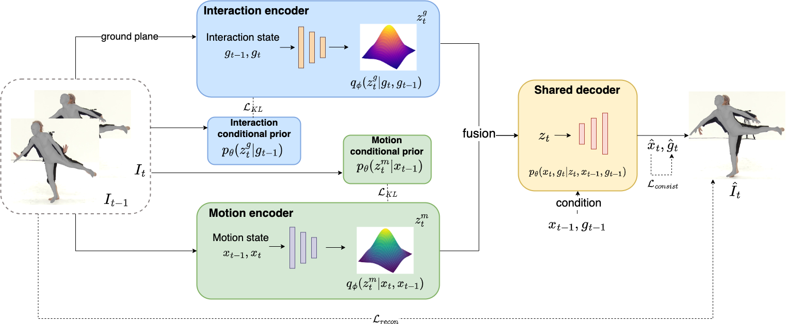

<h1 align="center">[ACMMM23] GraMMaR: Ground-aware Motion Model for 3D Human Motion Reconstruction</h1>

<p align="center">
<a href="https://arxiv.org/abs/2306.16736">.svg" ></a>
<a href="https://youtu.be/uA5jJFcnuAM?si=QJs0R3O3A4xq39zV"></a>
<a href="https://xymsh.github.io/GraMMaR"></a>
</p>

<h4 align="center">This is the official repository of the paper <a href="https://arxiv.org/abs/2306.16736">[ACMMM23] GraMMaR: Ground-aware Motion Model for 3D Human Motion Reconstruction</a>. 

The code will be released soon.</h4>


<h5 align="center">Sihan Ma, Qiong Cao, Jing Zhang, and Dacheng Tao</em></h5>

<p align="center">
  <a href="#introduction">Introduction</a> |
  <!-- <a href="#analysis">Interaction state</a> |
  <a href="#grammar">GraMMaR</a> |
  <a href="#optimization">Joint optimization</a> |
  <a href="#results">Results</a> | -->
  <a href="#statement">Statement</a> |
  <a href="https://youtu.be/uA5jJFcnuAM?si=QJs0R3O3A4xq39zV">Video Demo</a>
</p>


<p align="justify"> 3D motion in the camera view is misleading. A representative optimization method HuMoR [34 ] produces correct
poses under camera view but physically implausible poses in world view when faced with ambiguity (Row1) and noise (Row2).
In contrast, our method provides a ground-aware motion, thereby ensuring physical plausibility across all views. To achieve
it, we explicitly present the human-ground interaction and devise a CVAE-based model to jointly learn the distribution of
transitions in interaction and pose. Body torso direction and contacts for HuMoR and ours are highlighted. GT in Row1 is
reconstructed from multi-view images.</p>

<!-- ***
><h3><strong><i>:postbox: News</i></strong></h3>
>
> [2023-06-29]: The code will be released soon.
*** -->

## Introduction

<p align="justify">Demystifying complex human-ground interactions is essential for accurate and realistic 3D human motion reconstruction from RGB videos, as it ensures consistency between the humans and the ground plane.

Prior methods have modeled human-ground interactions either implicitly or in a sparse manner, often resulting in unrealistic and incorrect motions when faced with noise and uncertainty. In contrast, our approach explicitly represents these interactions in a dense and continuous manner.
To this end, we propose a novel **Gr**ound-**a**ware **M**otion **M**odel for 3D Human Motion **R**econstruction, named **GraMMaR**, which jointly learns the distribution of transitions in both pose and interaction between every joint and ground plane at each time step of a motion sequence. 
It is trained to explicitly promote consistency between the motion and distance change towards the ground. 

After training, we establish a joint optimization strategy that utilizes **GraMMaR** as a dual-prior, regularizing the optimization towards the space of plausible ground-aware motions. This leads to realistic and coherent motion reconstruction, irrespective of the assumed or learned ground plane.

Through extensive evaluation on the AMASS and AIST++ datasets, our model demonstrates good generalization and discriminating abilities in challenging cases including complex and ambiguous human-ground interactions. </p>



## Statement

<p align="justify">If you are interested in our work, please consider citing the following:</p> 

```
@inproceedings{ma2023grammar,
  title={GraMMaR: Ground-aware Motion Model for 3D Human Motion Reconstruction},
  author={Ma, Sihan and Cao, Qiong and Yi, Hongwei and Zhang, Jing and Tao, Dacheng},
  booktitle={Proceedings of the 31st ACM International Conference on Multimedia},
  pages={2817--2828},
  year={2023}
}
```

For further questions, please contact <strong><i>Sihan Ma</i></strong> at [sima7436@uni.sydney.edu.au](mailto:sima7436@uni.sydney.edu.au).

<p align="justify">This work is intended for studying the human motion reconstruction from monocular RGB videos, helping develop more realistic motion sequences that interact with the ground in a physically plausible way. Since our techniques can generate realistic and diverse 3D human motion sequences from videos, there is a risk that such techniques could be potentially misused for fake video generation. For instance, motion sequences from videos could be used to construct highly realistic 3D body motions while they never happened. Thus, we should use such technology responsibly and carefully. We hope to raise the public’s awareness about the safe use of such technology.</p>
